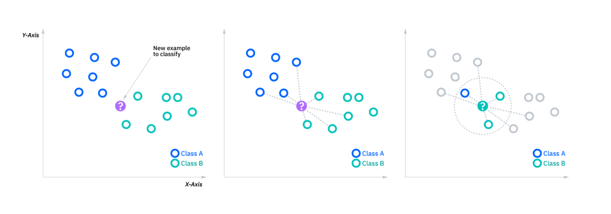

= Machine Learning
:status: bottom
:inclusion:
:experimental:
:toc: toc2
:icons: font
:window: _blank
:asciidoctorlink: link:http://asciidoctor.org/[Asciidoctor]indexterm:[Asciidoctor]

// Useful definitions
:asciidoc: http://www.methods.co.nz/asciidoc[AsciiDoc]
:icongit: icon:git[]
:git: http://git-scm.com/[{icongit}]
:plantuml: https://plantuml.com/fr/[plantUML]
:vscode: https://code.visualstudio.com/[VS Code]

ifndef::env-github[:icons: font]
// Specific to GitHub
ifdef::env-github[]
:!toc-title:
:caution-caption: :fire:
:important-caption: :exclamation:
:note-caption: :paperclip:
:tip-caption: :bulb:
:warning-caption: :warning:
:icongit: Git
endif::[]

== Qu’est-ce que le machine learning ?

Le machine learning, ou apprentissage automatique en français, est une branche de l'intelligence artificielle qui se concentre sur le développement de techniques permettant aux ordinateurs d'apprendre à partir de données et d'améliorer leurs performances sur une tâche spécifique sans être explicitement programmés. Le machine learning repose sur la capacité des ordinateurs à identifier des modèles dans les données et à prendre des décisions ou à effectuer des prédictions en fonction de ces modèles.

== Intelligence artificielle

L'intelligence artificielle (IA) est un domaine de l'informatique qui se consacre à la création de systèmes informatiques capables d'imiter des fonctions intellectuelles humaines, telles que la résolution de problèmes, l'apprentissage, la prise de décision, la reconnaissance de motifs, et la compréhension du langage naturel. L'objectif de l'IA est de développer des machines et des logiciels qui peuvent effectuer des tâches qui, autrement, nécessiteraient l'intelligence humaine. Elle englobe des techniques telles que le machine learning, le deep learning, le traitement du langage naturel, la vision par ordinateur, la robotique, et bien d'autres. L'IA est utilisée dans de nombreux domaines, y compris la médecine, la finance, l'automobile, la reconnaissance vocale, la traduction automatique, et la gestion des données, pour n'en nommer que quelques-uns.

== Exemples d'algorithmes

Les 3 types d'apprentissage seront présenté avec des algorithmes qui les utilise. Voici le lien du notebook Jupyther çi dessous.

https://github.com/Guilhamasse/machineLearning/blob/main/modelisationMaths.ipynb

== L'apprentissage supervisé

Dans ce type d'apprentissage, le modèle est entraîné sur un ensemble de données d'apprentissage étiquetées, où les réponses attendues sont connues. Le modèle apprend à faire des prédictions en se basant sur les caractéristiques des données d'entraînement. Par exemple, un modèle d'apprentissage supervisé pourrait être entraîné pour classer des e-mails comme "spam" ou "non spam" en se basant sur des exemples d'e-mails étiquetés.

=== Machine learning supervisé

Les algorithmes de machine learning supervisé sont les plus couramment utilisés. Avec ce modèle, un data scientist sert de guide et enseigne à l’algorithme les conclusions qu’il doit tirer. Tout comme un enfant apprend à identifier les fruits en les mémorisant dans un imagier, en apprentissage supervisé, l’algorithme apprend grâce à un jeu de données déjà étiqueté et dont le résultat est prédéfini.

Comme exemples de machine learning supervisé, on peut citer des algorithmes tels que la régression linéaire et logistique, la classification en plusieurs catégories et les machines à vecteurs de support.

== L'apprentissage non supervisé

Dans ce cas, le modèle est entraîné sur des données non étiquetées, et son objectif est d'identifier des structures ou des regroupements de données. Un exemple d'apprentissage non supervisé est le regroupement (clustering) de données, où le modèle identifie des groupes de données similaires sans connaître à l'avance les catégories.

=== Machine learning non supervisé

Le machine learning non supervisé utilise une approche plus indépendante dans laquelle un ordinateur apprend à identifier des processus et des schémas complexes sans un quelconque guidage humain constant et rigoureux. Le machine learning non supervisé implique une formation basée sur des données sans étiquette ni résultat spécifique défini.

Pour continuer avec l’analogie de l’enseignement scolaire, le machine learning non supervisé s’apparente à un enfant qui apprend à identifier un fruit en observant des couleurs et des motifs, plutôt qu’en mémorisant les noms avec l’aide d’un enseignant. L’enfant cherche des similitudes entre les images et les sépare en groupes, en attribuant à chaque groupe sa propre étiquette. Comme exemples d’algorithmes de machine learning non supervisés, on peut citer la mise en cluster de k-moyennes, l’analyse de composants principaux et indépendants, et les règles d’association.

== L'apprentissage par renforcement

Ce type d'apprentissage est utilisé pour des systèmes qui interagissent avec un environnement pour atteindre un objectif. L'agent apprend à prendre des actions qui maximisent une récompense cumulée. Les exemples incluent les robots autonomes, les jeux vidéo et les voitures autonomes.

K-means (ou K-moyennes) : C'est l'un des algorithmes de clustering les plus répandus. Il permet d'analyser un jeu de données caractérisées par un ensemble de descripteurs, afin de regrouper les données “similaires” en groupes (ou clusters).

L'algorithme du k-means est un algorithme très utilisé en clustering.
Il fonctionne généralement bien, il est rapide et relativement simple à comprendre.
Il est non déterministe, c'est-à-dire que les clusters obtenus peuvent changer légèrement si on relance l'algorithme plusieurs fois.
Il a toutefois besoin qu'on lui spécifie le nombre de clusters à produire.
Pour choisir le nombre de clusters, on applique la méthode du "coude", et on cherche une "cassure" dans la courbe liant la variance intraclasse au nombre de clusters.

Exemple sur un site de l'utilisation de K-means

https://kkevsterrr.github.io/K-Means/

https://openclassrooms.com/fr/courses/4525281-realisez-une-analyse-exploratoire-de-donnees/5177935-decouvrez-l-algorithme-k-means

https://colab.research.google.com/github/OpenClassrooms-Student-Center/4525281-realisez-une-analyse-exploratoire-de-donnees/blob/main/notebooks/P3C2_iris_k_means.ipynb

L'algorithme des k plus proches voisins, également connu sous le nom de KNN ou k-NN, est un discriminant d'apprentissage supervisé non paramétrique, qui utilise la proximité pour effectuer des classifications ou des prédictions sur le regroupement d'un point de données individuel.

SVM (Support Vector Machine ou Machine à vecteurs de support) : Les SVMs sont une famille d'algorithmes d'apprentissage automatique qui permettent de résoudre des problèmes tant de classification que de régression ou de détection d'anomalie.

== Exemple concret de machine learning

https://www.youtube.com/watch?v=Dw3BZ6O_8LY&t=20s

L'idée de créer une intelligence artificielle (IA) capable d'apprendre par le biais du Reinforcement Learning, comme illustré dans cette vidéo où elle cherche à réaliser les meilleurs scores dans Trackmania, offre un aperçu fascinant de l'apprentissage autonome des machines.

Initialement, cette IA commence sans connaissance du jeu, effectuant des actions de manière aléatoire. Cependant, chaque action est évaluée en fonction de sa performance, récompensant les actions bénéfiques par des points. À travers de multiples essais et erreurs, l'IA apprend progressivement le meilleur chemin à emprunter pour maximiser ses gains.

La clé de cette progression réside dans la création et l'utilisation d'une base de données considérable. Cette base de données stocke une quantité colossale d'essais, permettant à l'IA d'analyser, apprendre et prendre des décisions plus intelligentes au fil du temps. En se basant sur ces données, elle affine ses choix et améliore ses performances sur le circuit, évoluant vers une maîtrise plus fine du jeu.

Ce processus de perfectionnement par essais et erreurs nécessite une infrastructure solide et des capacités de traitement de données importantes. Pour des projets plus vastes que la simple optimisation de jeu, le volume de calcul requis augmente considérablement. Des applications plus complexes, comme la gestion logistique, la modélisation financière ou même la recherche médicale, exigent des quantités massives de données et de calculs pour que l'IA puisse apprendre et évoluer de manière significative.

Ainsi, cette démonstration sur Trackmania offre un aperçu des défis et des possibilités de l'apprentissage automatique, soulignant à quel point des projets plus vastes nécessiteraient des ressources considérables en termes de calcul et de stockage de données pour permettre à l'IA d'apprendre de manière efficace et de réaliser des avancées significatives.
